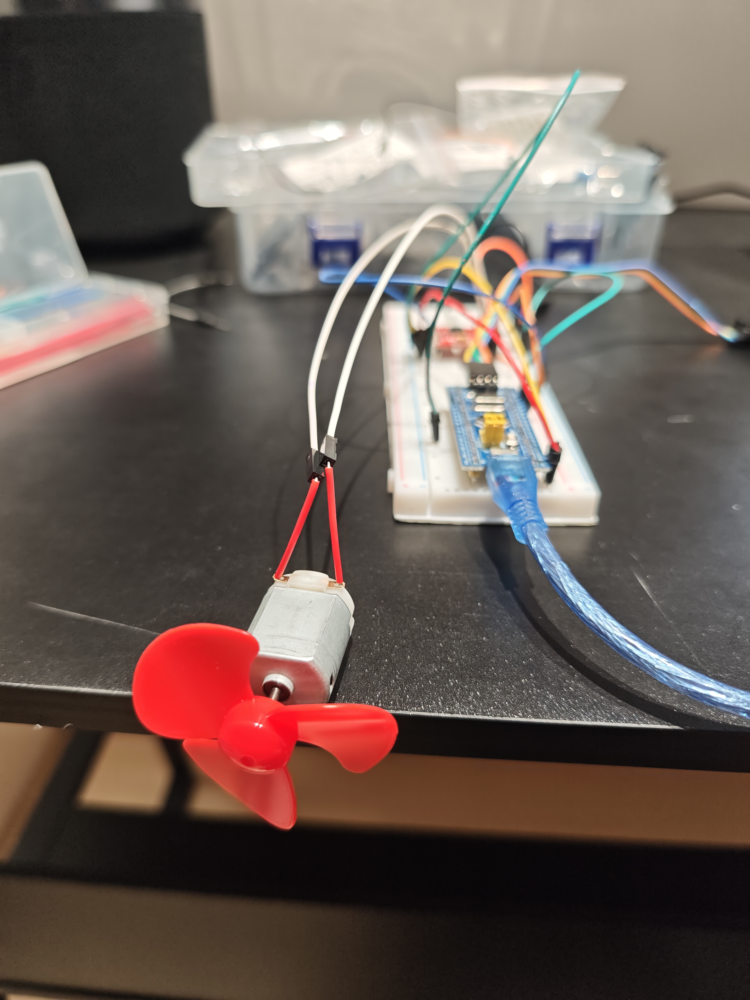

# 🔧 STM32 入门教程：从点亮第一颗 LED 到驱动直流电机

> **不用 STM32CubeMX，也不用啃寄存器手册。**
> 本教程带你从零把 STM32F103 跑起来 —— 装环境、接线、烧录、排错，再一路做呼吸灯、蜂鸣器、多档位风扇，每一步都可以照着复现。

[](https://www.st.com/)
[](https://www.arduino.cc/en/software)
[](https://github.com/stm32duino/Arduino_Core_STM32)
[-orange)](#-快速开始)
[](LICENSE)

---

## 📖 这是什么

一份写给**嵌入式新手**的 STM32 实践教程，目前包含 4 篇，沿着「数字输出 → PWM → 输入 → 功率驱动」这条最自然的主线往前走。

STM32CubeMX 的安装包需要登录 ST 账号下载，网络受限时极易卡住，所以本教程改用 **Arduino IDE + STM32duino 核心库**的路线：不装重型 IDE，Arduino 生态的库即装即用，先把硬件跑通、把信心建立起来。等以后需要寄存器级或 HAL 开发时，再平滑切换到 STM32CubeIDE 也完全来得及。

**跟着做完，你会掌握：**

- STM32duino 核心包的安装与开发板参数配置，用 ST-Link V2 通过 **SWD** 接口烧录
- 外部 LED 的接线，以及「高电平点亮 / 低电平点亮」这个经典坑
- **PWM 与占空比** —— 用 `analogWrite()` 做呼吸灯、调速电机
- **按键输入**：内部上拉、边沿检测、软件消抖
- **有源 / 无源蜂鸣器**的区别与驱动方式
- 用 **TB6612FNG** 驱动直流电机，写一个多档位状态机
- 硬件排错的基本功：**短接法**查杜邦线、从板载 LED 判断**欠压复位**、**独立供电 + 共地**

---

## 🎬 先看效果

| 01 · 点亮外部 LED | 04 · 多档位风扇 |
| :---: | :---: |
|  |  |

---

## 🛠️ 硬件清单

| 硬件名称 | 数量 | 说明 |
| --- | :---: | --- |
| STM32F103 最小系统板 | 1 | C8T6 / RBT6（BluePill 板型） |
| ST-Link V2 仿真器 | 1 | SWD 烧录。⚠️ 不能同时被 STM32CubeProgrammer 占用 |
| TB6612FNG 电机驱动模块 | 1 | 教程 04 用，双 H 桥 |
| 130 直流电机 + 扇叶 | 1 | 教程 04 用 |
| 有源蜂鸣器模块 | 1 | 教程 03 用（教程用的是 MH-FMD 三针模块） |
| 两脚常开按键 | 1 | 教程 02 / 03 / 04 用，接 `INPUT_PULLUP` |
| 面包板 | 1 | |
| LED 灯 | 1 | 教程使用绿色 LED，接 `PA5` |
| 杜邦线（母对母） | 若干 | ⚠️ 质量参差，内部断线是「玄学故障」头号嫌疑人 |
| 1KΩ 电阻 | 1 | 限流用。⚠️ 教程 01 实测时未接，LED 偏暗，**建议你接上** |
| USB Micro 数据线 | 1 | 给开发板供电 |
| 外部 5V 电源（电池盒 / 充电宝） | 1 | 教程 04 用。⚠️ 驱动电机**强烈建议**配一个 |

---

## 📂 仓库目录结构

```
STM32/
├── README.md                                  ← 你正在读的这份文档
├── LICENSE                                    ← MIT 许可证
├── .gitignore / .gitattributes
├── firmware/                                  ← 按教程顺序排列的 STM32 sketch
│   ├── Test_LED/                              ← 教程 01：外部 LED（PA5）闪烁
│   │   └── Test_LED.ino
│   ├── PWM_LED/                               ← 教程 02：PWM 呼吸灯 + 按键开关
│   │   └── PWM_LED.ino
│   ├── Buzzer_test/                           ← 教程 03：按键控制有源蜂鸣器
│   │   └── Buzzer_test.ino
│   ├── use_button_control_fan/                ← 教程 04-1：按住按键电机就转（先验证硬件）
│   │   └── use_button_control_fan.ino
│   └── MultiSpeed_Fan/                        ← 教程 04-2：按键循环切换 0~3 档风速
│       └── MultiSpeed_Fan.ino
├── Image_and_video/                           ← 接线实拍与演示素材
│   ├── green_led_breadboard.jpg
│   ├── Buzzer_test.jpg
│   └── Fan-control.jpg
└── docs/
    ├── 01_ENVIRONMENT_AND_BLINK.md            ← 教程 01：环境搭建、接线与排错
    ├── 02_PWM_AND_BREATHING_LED.md            ← 教程 02：PWM 调光与呼吸灯
    ├── 03_BUTTON_AND_BUZZER.md                ← 教程 03：按键控制有源蜂鸣器
    └── 04_DC_MOTOR_MULTI_SPEED_FAN.md         ← 教程 04：TB6612 驱动电机与多档位风扇
```

---

## 🚀 快速开始

### 第 1 步：安装 Arduino IDE

下载并安装 [Arduino IDE 2.x](https://www.arduino.cc/en/software)（1.8.x 同样可用）。

### 第 2 步：添加 STM32 开发板索引

`文件` → `首选项` → 「附加开发板管理器网址」填入：

```
https://github.com/stm32duino/BoardManagerFiles/raw/main/package_stmicroelectronics_index.json
```

> 若提示索引更新失败，多半是系统代理的问题 —— 见 [常见报错速查](#-常见报错速查)。

### 第 3 步：安装核心包

`工具` → `开发板` → `开发板管理器`，搜索并安装 **`STM32 MCU based boards`**（下载体积较大，请耐心等待）。

### 第 4 步：安装烧录工具

安装 [STM32CubeProgrammer](https://www.st.com/en/development-tools/stm32cubeprog.html)。Arduino IDE 底层依赖它通过 ST-Link 进行 SWD 烧录。

### 第 5 步：配置开发板参数

| 设置项 | 取值 |
| --- | --- |
| Board | `Generic STM32F1 series` |
| Board Part Number | `BluePill F103C8` |
| U(S)ART support | `Enabled (generic 'Serial')` |
| Upload method | `STM32CubeProgrammer (SWD)` |

### 第 6 步：接线并上传

按下面的表把 ST-Link V2 接到板子上，再把 LED 接到 `PA5`：

| ST-Link V2 | STM32 引脚 |
| --- | --- |
| SWDIO | `PA13` |
| SWCLK | `PA14` |
| GND | `GND`（必须接） |
| 3.3V | `3.3V`（板子已用 USB 供电时可不接） |

然后打开 [`firmware/Test_LED/Test_LED.ino`](firmware/Test_LED/Test_LED.ino)，点击「上传」。

🎉 **LED 开始闪烁，说明整条链路已经通了。**

到这里「工具链」就搭好了，后面 02 / 03 / 04 篇可以直接在 Arduino IDE 里换个 sketch 上传，环境不需要再动。

> 🔍 接线照片、逐项报错排查和原理说明，见 **[docs/01_ENVIRONMENT_AND_BLINK.md](docs/01_ENVIRONMENT_AND_BLINK.md)**。

---

## 🔌 引脚速查

### 各篇教程用到的引脚

| 引脚 | 用于 | 用途 | 电平逻辑 |
| --- | :---: | --- | --- |
| `PA5` | 01 | 外部 LED | **高电平点亮** |
| `PA5` | 02 | PWM 调光输出 | `analogWrite()` 0~255 |
| `PA5` | 03 | 蜂鸣器模块 `I/O` | 见 [03 篇触发极性说明](docs/03_BUTTON_AND_BUZZER.md) |
| `PA5` | 04 | TB6612 的 `PWMA` | `analogWrite()` 0~255 |
| `PA1` | 02 / 03 | 按键（`INPUT_PULLUP`） | 按下 = `LOW` |
| `PA2` | 04 | 按键（`INPUT_PULLUP`） | 按下 = `LOW` |
| `PB12` | 04 | TB6612 的 `AIN1` | 方向控制 |
| `PB13` | 04 | TB6612 的 `AIN2` | 方向控制 |

> ⚠️ **`PA5` 在 4 篇里接了 4 种不同的外设**，换实验时记得**同时改接线和代码**，别让旧接线留在面包板上。

### 固定用途的引脚

| 引脚 | 用途 | 说明 |
| --- | --- | --- |
| `PA13` | SWDIO | 接 ST-Link 的 SWDIO，烧录用 |
| `PA14` | SWCLK | 接 ST-Link 的 SWCLK，烧录用 |
| `PC13` | 板载 LED（红色） | **低电平点亮** ⚠️ 与外接 LED 相反；**闪一下 = 复位** |
| `GND` | 共地 | 与 ST-Link、面包板、**外部电源**都必须连在一起 |
| `3.3V` / `5V` | 供电 | 板子已用 USB 供电时可不接 ST-Link 的 3.3V |

> ⚠️ **最容易踩的坑**：板载 LED（`PC13`）是**低电平点亮**，外接 LED（`PA5`）是**高电平点亮**，换引脚时千万别忘了同步交换 `digitalWrite` 的高低电平。

---

## 🚧 常见报错速查

| 报错 / 现象 | 原因 | 解决 |
| --- | --- | --- |
| `Some indexes could not be updated... read tcp ... wsarecv...` | IDE 走了系统代理，网络受限 | 首选项里改为**无代理**并重启 IDE；或换清华镜像源 |
| `No debug probe detected` | STM32CubeProgrammer 后台运行，**独占了 ST-Link** | 关闭 STM32CubeProgrammer，拔插 ST-Link 后重试上传 |
| 外部 LED 不亮 | 引脚定义成了 `PC13`，或高低电平逻辑写反 | 改成 `#define LED_PIN PA5`，外接 LED 需 `HIGH` 点亮 |
| LED 亮度偏暗 | 未串联限流电阻 | 串上 **1KΩ 电阻** |
| `analogWrite()` 只有全亮 / 全灭 | 该引脚不支持硬件 PWM | 换一个支持 PWM 的引脚 |
| 蜂鸣器上电就一直响 | 模块是**低电平触发**，代码电平写反 | 对调 `digitalWrite` 的 `HIGH` / `LOW` |
| 蜂鸣器声音太小 | 有源蜂鸣器音量由硬件决定；防尘贴纸挡住了发声孔 | 撕掉顶部 `REMOVE SEAL AFTER WASHING` 贴纸；或改用 5V 供电 |
| 按键怎么按都没反应 | **杜邦线内部断路**（外皮完好，肉眼看不出来） | 把按键信号脚**直接短接到 GND** 测试；换一根线 |
| 电机一转，STM32 就复位（板载红灯闪一下） | USB 供电能力不足（约 500 mA），电机启动浪涌把 5V 拉低 | 给电机接**独立 5V 电源**，并与 STM32 **共地** |
| 电机纹丝不动 | TB6612 的 `STBY` 没接高电平；或 `AIN1`/`AIN2` 都是低 | `STBY` 接 `3.3V`；按真值表给 `AIN1`/`AIN2` 一个高一个低 |

> 完整复盘（含报错原文、排查过程与原理）见各篇文档的「🚧 踩坑与排错」章节。

---

## 📚 教程目录

| 篇 | 内容 | 文档 |
| :---: | --- | --- |
| **01** | 环境搭建 · ST-Link SWD 烧录 · 点亮外部 LED | [📄 环境搭建与点亮第一个 LED](docs/01_ENVIRONMENT_AND_BLINK.md) |
| **02** | PWM 原理 · `analogWrite()` · 呼吸灯 · 按键开关 | [📄 PWM 调光与呼吸灯](docs/02_PWM_AND_BREATHING_LED.md) |
| **03** | 有源 / 无源蜂鸣器 · 边沿检测 · 按键开关 | [📄 按键控制有源蜂鸣器](docs/03_BUTTON_AND_BUZZER.md) |
| **04** | TB6612FNG · H 桥 · 直流电机 · 多档位状态机 · 供电排错 | [📄 TB6612 驱动直流电机与多档位风扇](docs/04_DC_MOTOR_MULTI_SPEED_FAN.md) |

**建议的练习顺序**

- [ ] 跑通 01，用板载 LED（`PC13`）再验证一遍「低电平点亮」
- [ ] 调快 / 调慢闪烁频率，理解 `delay()` 的阻塞行为
- [ ] 做 02 的呼吸灯，把 `delay(5)` 改成 `15` / `2` 观察速度变化
- [ ] 把 02 的按键改成「三个档位亮度循环」
- [ ] 做 03 的蜂鸣器开关，再换成**无源蜂鸣器**用 PWM 奏出音调
- [ ] 做 04：先用「按住就转」验证硬件，再实现多档位风扇
- [ ] 给 04 的电机加**软启动**（`analogWrite` 从 0 缓慢升到目标档位）
- [ ] 用 `millis()` 替换所有 `delay()`，实现非阻塞的多档位风扇
- [ ] 接 14 号（NTC）热敏电阻，让风扇**根据温度自动调速**
- [ ] 打开串口（`Serial.print`），把温度、档位打印到电脑上
- [ ] 定时器中断与外部中断
- [ ] I2C / SPI 外设（OLED、传感器）
- [ ] 迁移到 **STM32CubeIDE + HAL 库**，对比 Arduino 封装与寄存器操作的差异

---

## 🤝 贡献与致谢

- 欢迎提交 Issue 反馈问题，或 PR 补充你的踩坑经验 —— 让后面的人少走弯路。
- 本仓库的组织方式参考了 [Arduino-Intro](https://github.com/Arduino-STM32-Dev/Arduino-Intro)。

## 📄 许可证

本项目采用 **MIT License**，详见 [LICENSE](LICENSE)。
