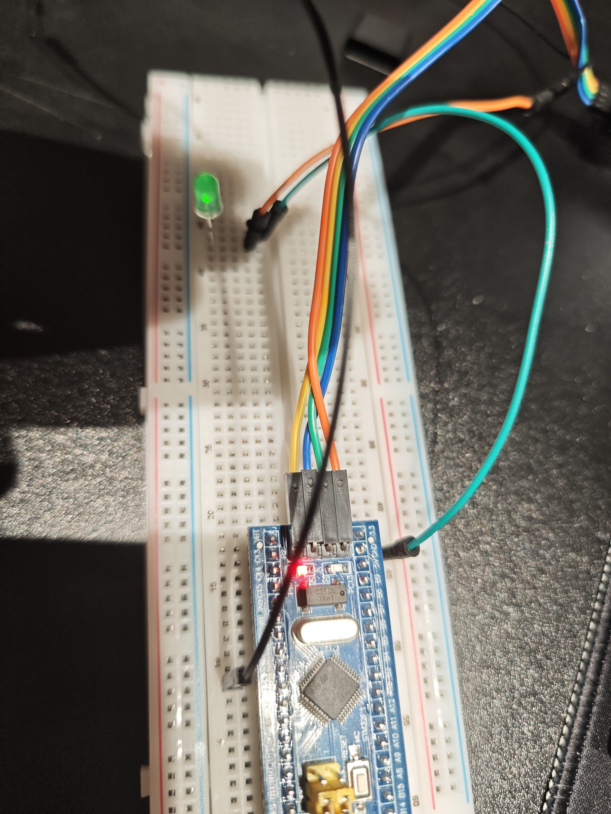

# STM32 入门 01：环境搭建与点亮第一个 LED

> **本篇目标**：跑通 STM32F103 的开发与烧录链路，点亮第一颗 LED
> **适用环境**：STM32F103C8T6（BluePill）· Arduino IDE 2.x · STM32duino 核心库 · ST-Link V2
> **完成标志**：外部绿色 LED（`PA5`）以 500 ms 周期稳定闪烁

---

## 📌 为什么不用 STM32CubeMX

STM32CubeMX 的安装包需要**登录 ST 账号**才能下载，网络受限时极易卡在下载环节；即便装上，HAL 库的工程结构与时钟树配置对新手也是一道不低的门槛。

所以本篇改用 **Arduino IDE + STM32duino 核心库**的路线：

| | Arduino IDE + STM32duino | STM32CubeMX + HAL / 寄存器 |
| --- | --- | --- |
| 上手难度 | 低，`pinMode` / `digitalWrite` 即可 | 高，需要理解时钟树、外设初始化 |
| 安装 | 装 IDE + 装核心包，无需 ST 账号 | 需要 ST 账号下载安装包 |
| 适合阶段 | 刚入门、快速验证硬件 | 需要精确控制外设、追求性能时 |

先用简单的路线把硬件跑通、把信心建立起来，等真正需要寄存器级或 HAL 开发时再平滑切换，完全来得及。

---

## 🛠️ 硬件准备

| 硬件 | 数量 | 说明 |
| --- | :---: | --- |
| STM32F103 最小系统板 | 1 | C8T6 / RBT6（BluePill 板型） |
| ST-Link V2 仿真器 | 1 | 负责烧录，**同时只能被一个软件占用** |
| 面包板 | 1 | |
| 绿色 LED 灯 | 1 | 本篇的观察对象 |
| 杜邦线（母对母） | 若干 | |
| 1KΩ 金属膜电阻 | 1 | 限流用，**建议接上**（见下方注意事项） |
| USB Micro 数据线 | 1 | 可选，给开发板独立供电 |

> ⚠️ **关于限流电阻**：本篇实测时为了先验证硬件，**暂时没有串联 1KΩ 限流电阻**，导致 LED 亮度较暗。
> 你照着做的时候建议直接把电阻串进去，既能让亮度正常，也能保护 LED 与 IO 口。

---

## 💻 软件环境配置

1. **安装 Arduino IDE (2.x)** —— [下载地址](https://www.arduino.cc/en/software)

2. **配置开发板管理器**：`文件` → `首选项` → 「附加开发板管理器网址」中填入 STM32 官方索引地址：

   ```
   https://github.com/stm32duino/BoardManagerFiles/raw/main/package_stmicroelectronics_index.json
   ```

   > 注：若遇网络代理问题，可改用**清华镜像源**。

3. **安装核心包**：`工具` → `开发板` → `开发板管理器`，搜索并安装 `STM32 MCU based boards`。
   这个包体积不小，下载慢是正常的，装完记得重启 IDE。

4. **安装烧录工具**：安装 `STM32CubeProgrammer`，Arduino IDE 底层依赖它通过 ST-Link 进行 SWD 烧录。

5. **配置 IDE 关键参数**：

   | 设置项 | 取值 |
   | --- | --- |
   | Board | `Generic STM32F1 series` |
   | Board Part Number | `BluePill F103C8` |
   | U(S)ART support | `Enabled (generic 'Serial')` |
   | Upload method | `STM32CubeProgrammer (SWD)` |

---

## 🔌 硬件接线

### ST-Link V2 ↔ STM32（SWD 四线）

| ST-Link V2 | STM32 引脚 | 说明 |
| --- | --- | --- |
| SWDIO | `PA13` (SWDIO) | 数据线 |
| SWCLK | `PA14` (SWCLK) | 时钟线 |
| GND | `GND` | 共地，**必须接** |
| 3.3V | `3.3V` | 若板子已通过 Micro USB 供电，此线可不接 |

### LED 电路

```
PA5 ──►│── 面包板 GND 轨 ── STM32 GND
     绿色 LED
```

- `PA5` → 绿色 LED **长脚（正极）**
- LED **短脚（负极）** → 面包板 GND 轨 → STM32 的 `GND`

> 💡 接入 1KΩ 电阻时，把它串在 `PA5` 与 LED 长脚之间即可。

### 接线实拍



---

## 💻 核心代码

代码位于 [`firmware/Test_LED/Test_LED.ino`](../firmware/Test_LED/Test_LED.ino)：

```cpp
// 方法一：测试板载 LED（无需外接元件，推荐先测试这个）
//#define LED_PIN PC13  // 大多数 STM32F103 最小系统板的板载 LED 在 PC13，低电平点亮

// 方法二：测试接在面包板上的外部 LED（本次实验使用，高电平点亮）
#define LED_PIN PA5

void setup() {
  // 初始化 LED 引脚为输出模式
  pinMode(LED_PIN, OUTPUT);
}

void loop() {
  digitalWrite(LED_PIN, HIGH);  // 点亮 LED（外部 LED 为高电平点亮）
  delay(500);                   // 等待 500 毫秒
  digitalWrite(LED_PIN, LOW);   // 熄灭 LED
  delay(500);                   // 等待 500 毫秒
}
```

**想动手改参数？**

| 位置 | 含义 | 可以怎么改 |
| --- | --- | --- |
| `#define LED_PIN PA5` | 外部 LED 接在 `PA5` | 改成 `PC13` 可改测板载 LED（**记得同时交换高低电平**） |
| `delay(500)` | 亮 / 灭各持续 500 ms | 改小（如 `100`）闪得更快，改大（如 `1000`）闪得更慢 |

---

## ✅ 验证：你应该看到什么

1. Arduino IDE 底部提示 `上传成功`；
2. 板子上的电源指示灯常亮；
3. **面包板上的绿色 LED 以约 1 秒一个完整周期闪烁**（亮 0.5 s，灭 0.5 s）。

如果第 3 步没出现，先别怀疑板子坏了 —— 九成是下面几个坑之一。

---

## 🚧 踩坑与解决（Troubleshooting）

### 1. Arduino IDE 开发板索引下载失败（网络代理报错）

- **报错现象**：
  ```
  Some indexes could not be updated... read tcp 192.168.0.115... wsarecv...
  ```
- **原因**：IDE 设置了系统代理，或网络受限。
- **解决**：在首选项中**关闭代理**，使用「无代理」并重启 IDE；或更换**清华大学镜像源**。

### 2. 上传报错 `No debug probe detected`

- **报错现象**：点击上传后提示 `No debug probe detected`。
- **原因**：`STM32CubeProgrammer` 软件正在后台运行，**独占占用了 ST-Link 硬件资源**。
- **解决**：关闭 STM32CubeProgrammer 软件，**拔插 ST-Link 释放资源**，再返回 Arduino IDE 点击上传。

### 3. LED 不亮

- **原因 1**：代码中 `LED_PIN` 定义成了 `PC13`（板载红灯），而实际外部 LED 接的是 `PA5`。
- **原因 2**：STM32 的**板载 LED** 是 `LOW` 点亮，而**外部 LED** 需要 `HIGH` 才是点亮。
- **解决**：修改代码 `#define LED_PIN PA5`，并**交换 `digitalWrite` 的高低电平逻辑**。

---

## 🔎 原理小结：为什么两个 LED 的极性相反

| | 板载 LED（`PC13`） | 外接 LED（`PA5`） |
| --- | --- | --- |
| 接法 | 引脚 → LED → **VCC** | 引脚 → LED → **GND** |
| 导通条件 | 引脚输出**低电平**，电流从 VCC 流向引脚 | 引脚输出**高电平**，电流从引脚流向 GND |
| 代码 | `digitalWrite(pin, LOW)` 点亮 | `digitalWrite(pin, HIGH)` 点亮 |

板载 LED 采用的是「灌电流（sink）」接法，外接 LED 一般是「拉电流（source）」接法 —— 这就是同一个 `HIGH` / `LOW` 在两处效果完全相反的原因。**换引脚时，别忘了同步换逻辑。**

---

## 🚀 继续往下

- [ ] 用板载 LED（`PC13`）再跑一遍，亲手验证「低电平点亮」的结论
- [ ] 调快 / 调慢闪烁频率，感受 `delay()` 的阻塞特性
- [ ] 加入**按键输入**（`INPUT_PULLUP` + 软件消抖），实现「按一下切换亮灭」
- [ ] 用 `millis()` 替换 `delay()`，实现**非阻塞闪烁**
- [ ] 打开**串口输出**（`Serial.print`），把状态打印到电脑上
- [ ] PWM 调光，做一颗呼吸灯

---

## 🔗 参考链接

- [STM32duino 官方文档](https://github.com/stm32duino/Arduino_Core_STM32)
- [STM32 开发板管理器索引文件](https://github.com/stm32duino/BoardManagerFiles/raw/main/package_stmicroelectronics_index.json)
- [STM32CubeProgrammer 下载页](https://www.st.com/en/development-tools/stm32cubeprog.html)
