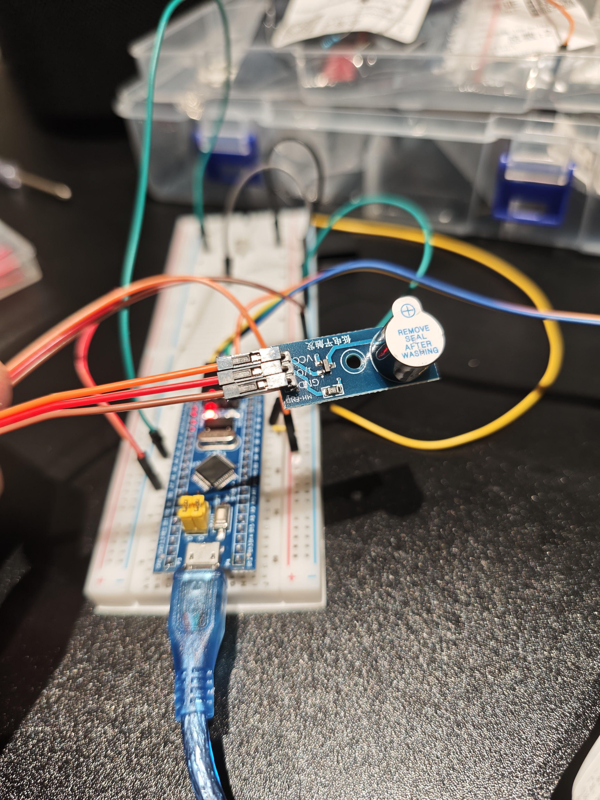

# STM32 入门 03：按键控制有源蜂鸣器

> **本篇目标**：分清「有源」和「无源」蜂鸣器，用按键做一个「按一下响、再按一下停」的开关
> **适用环境**：STM32F103C8T6（BluePill）· Arduino IDE 2.x · STM32duino 核心库 · ST-Link V2
> **完成标志**：上电后蜂鸣器安静；按一下按键开始响，再按一下停

---

## 📌 有源蜂鸣器 vs 无源蜂鸣器

买蜂鸣器时最常见的一个坑：**「有源」不是指「有电源」，而是指「内部自带振荡源」。**

| | **有源蜂鸣器** | **无源蜂鸣器** |
| --- | --- | --- |
| 内部振荡源 | 有，通电就按固定频率发声 | 无，需要外部给它方波 |
| 驱动方式 | `digitalWrite()` 给个电平就响 | 必须用 PWM 方波驱动 |
| 音调 | **固定**，改不了 | 由方波频率决定，可以奏出旋律 |
| 想改变音量 | 只能改硬件（见下方踩坑 1） | 同样是硬件决定 |
| 典型用途 | 报警、提示音 | 电子琴、播放简单音乐 |

**怎么分辨？** 看背面：有源的底面通常是密封的黑胶，无源的能看到裸露的线圈和振膜。

本篇用的是 **MH-FMD** 模块上的**有源**蜂鸣器，所以代码里一句 `digitalWrite()` 就够了，用不上 `analogWrite()`。

---

## 🛠️ 硬件准备

| 硬件 | 数量 | 说明 |
| --- | :---: | --- |
| STM32F103 最小系统板 | 1 | C8T6 / RBT6（BluePill 板型） |
| ST-Link V2 仿真器 | 1 | 烧录用 |
| 有源蜂鸣器模块 | 1 | 本篇用 MH-FMD 三针模块 |
| 两脚常开按键 | 1 | 接 `PA1`，用来开关蜂鸣器 |
| 面包板 | 1 | |
| 杜邦线（母对母） | 若干 | ⚠️ 质量参差，见 04 篇踩坑 |
| USB Micro 数据线 | 1 | 给开发板供电 |

---

## 🔌 硬件接线

### 蜂鸣器模块（三针）

模块上印着三个引脚：`VCC` / `I/O` / `GND`。

| 模块引脚 | 接到 | 说明 |
| --- | --- | --- |
| `VCC` | STM32 `3.3V` | 模块供电 |
| `GND` | STM32 `GND` | 共地 |
| `I/O` | `PA5` | 控制信号 |

### 按键电路

| 按键一端 | 另一端 |
| --- | --- |
| `PA1` | `GND` |

同样用 `INPUT_PULLUP` 打开 STM32 内部上拉，**不需要外接电阻**：松开读到 `HIGH`，按下读到 `LOW`。

### 接线实拍



> ⚠️ **注意触发极性**：蜂鸣器模块分「**高电平触发**」和「**低电平触发**」两种，模块丝印上一般会直接标出来。
> 判断方法很简单：**如果一上电蜂鸣器就一直响**，说明它是低电平触发，把代码里 `digitalWrite(BUZZER_PIN, ...)` 的 `HIGH` 和 `LOW` 对调即可。

---

## 💻 核心代码

代码位于 [`firmware/Buzzer_test/Buzzer_test.ino`](../firmware/Buzzer_test/Buzzer_test.ino)：

```cpp
#define BUZZER_PIN PA5
#define BUTTON_PIN PA1

bool buzzerState = false; // 记录蜂鸣器状态（初始关闭）
int lastButtonState = HIGH;

void setup() {
  pinMode(BUZZER_PIN, OUTPUT);
  pinMode(BUTTON_PIN, INPUT_PULLUP);
  digitalWrite(BUZZER_PIN, LOW);
}

void loop() {
  int currentButtonState = digitalRead(BUTTON_PIN);
  
  // 检测“按下的那一瞬间”
  if (currentButtonState == LOW && lastButtonState == HIGH) {
    buzzerState = !buzzerState; // 翻转开关状态
    
    if (buzzerState) {
      digitalWrite(BUZZER_PIN, HIGH); // 开启
    } else {
      digitalWrite(BUZZER_PIN, LOW);  // 关闭
    }
    delay(50); // 消抖
  }
  
  lastButtonState = currentButtonState;
}
```

### 代码怎么读

这段代码和 02 篇的按键部分是同一个套路，核心只有一句：

```cpp
if (currentButtonState == LOW && lastButtonState == HIGH)
```

这叫**边沿检测**（检测「按下的那一瞬间」）。

如果偷懒写成 `if (digitalRead(BUTTON_PIN) == LOW)`，那么按住按键不松手期间，`loop()` 每一轮都会执行一次 `buzzerState = !buzzerState` —— 蜂鸣器会以极高的频率疯狂开关，听起来像坏了一样。

**想动手改参数？**

| 位置 | 含义 | 可以怎么改 |
| --- | --- | --- |
| `bool buzzerState = false` | 上电默认不响 | 改成 `true` 让它上电就响 |
| `#define BUZZER_PIN PA5` | 蜂鸣器接在 `PA5` | 换到别的引脚，换完同步改接线 |
| `HIGH` / `LOW` | 按模块的触发极性写 | 上电一直响就对调这两个电平 |

---

## ✅ 验证：你应该看到什么

1. Arduino IDE 底部提示 `上传成功`；
2. 上电后蜂鸣器**安静**（如果一直响，见下方踩坑 2）；
3. 按一下按键 → 蜂鸣器持续鸣响；
4. 再按一下 → 停止。

---

## 🚧 踩坑与提醒

### 1. 有源蜂鸣器的音量，代码改不了

有源蜂鸣器的发声频率和音量**都由硬件决定**，你在代码里怎么写都改不动音量 —— 这是它的特性，不是代码写错了。

两个物理层面的办法：

- **撕掉顶部的防尘贴纸**。本次使用的模块出厂时贴着一张印有 `REMOVE SEAL AFTER WASHING` 的白色贴纸，它正好挡在蜂鸣器的发声孔上，撕掉之后音量会明显变大。
- **改用 5V 供电**。注意很多模块只标了 `VCC` 没写耐压范围，接 5V 前先确认模块支持。

> 💡 如果确实需要「可调音量 / 可变音调」，那就应该换成**无源蜂鸣器** + `analogWrite()` 输出不同频率的方波。

### 2. 上电蜂鸣器就一直响，或者按了没反应

- **原因**：模块的**触发极性和代码里的电平写反了**。
- **解决**：把 `digitalWrite(BUZZER_PIN, HIGH)` 和 `digitalWrite(BUZZER_PIN, LOW)` 对调。

### 3. 按一下，蜂鸣器却切换了好几次

- **原因**：机械按键的**抖动**（触点弹跳），几毫秒内电平反复横跳。
- **解决**：`delay(50)` 软件消抖，把抖动期跳过去再继续。

---

## 🔎 原理小结：为什么按键必须检测「边沿」

`loop()` 每秒会执行成千上万次。如果判断条件是「当前是不是低电平」：

| 写法 | 按住按键 1 秒会发生什么 |
| --- | --- |
| `if (digitalRead(BUTTON_PIN) == LOW)` | 状态被翻转**几千次**，实际行为完全不可预测 |
| `if (current == LOW && last == HIGH)` | 只在按下的**那一次**翻转，按住不放也只切换一次 |

所以按键开关的标准写法永远是**「边沿检测 + 记录上一次的状态」**，这几乎是所有嵌入式交互代码的基础模式。

---

## 🚀 继续往下

- [ ] 上电就让蜂鸣器响，验证 `buzzerState = true` 的初始状态
- [ ] 加第二个按键，做成「按 A 响、按 B 停」
- [ ] 换成**无源蜂鸣器**，用 `analogWrite()` 改变方波频率，奏出不同音调
- [ ] 给蜂鸣器加个「报警」场景：温度超限就响（配合温度传感器）
- [ ] 用按键切换**直流电机**档位 → 见 [04 篇](04_DC_MOTOR_MULTI_SPEED_FAN.md)

---

## 🔗 参考链接

- [Arduino `INPUT_PULLUP` 说明](https://docs.arduino.cc/learn/microcontrollers/digital-pins/)
- [STM32duino 官方文档](https://github.com/stm32duino/Arduino_Core_STM32)
